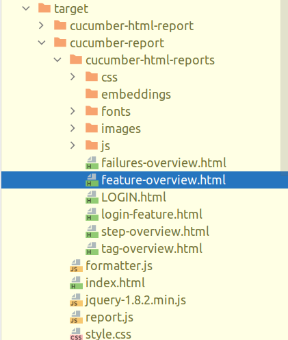
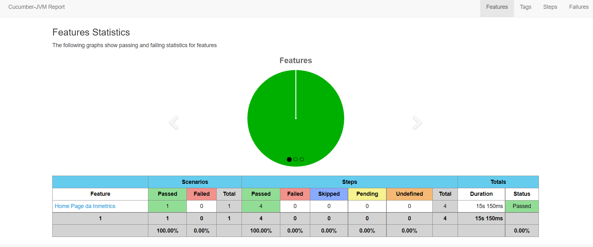
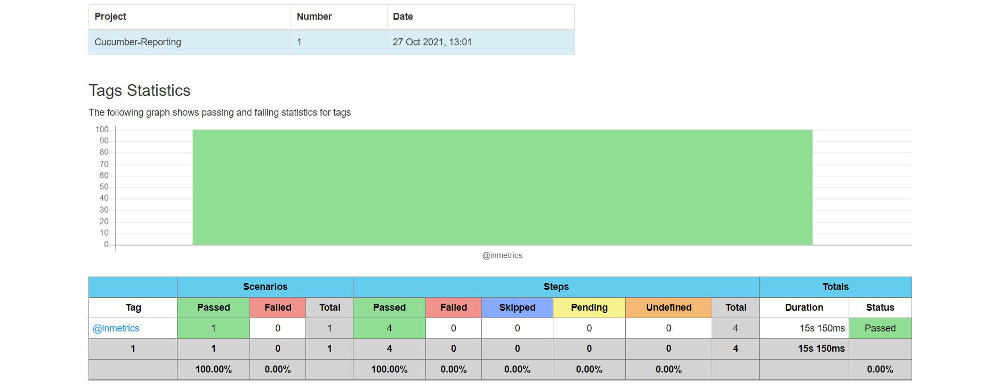
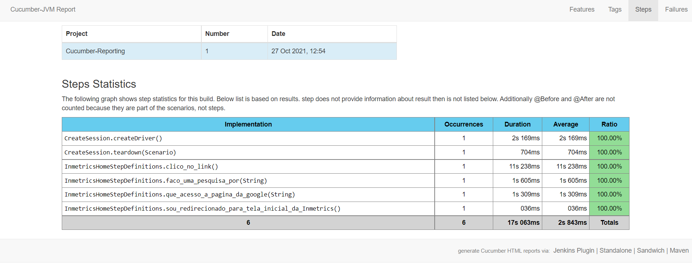

# Estrutura de automação com Selenium Webdriver e Cucumber

Estrutura de automação de desenvolvimento orientada por comportamento usando selenium webdriver, cucumber-java, testng, maven, phantomjs

## Ferramentas e tecnologias utilizadas:

1. Language: Java 8
2. Testing framework: Testng
3. BDD framework: Cucumber jvm
4. Automation tool: Selenium webdriver
5. Build tool: maven
6. Logging: log4j
7. Headless browser: Phantomjs
8. Reporting: [cucumber reporting](https://github.com/damianszczepanik/cucumber-reporting)

## Características da estrutura
1. BDD framework usando Cucumber-jvm. Arquivos de feature podem ser gravados facilmente usando Dado, Quando, Então, etc.
2. Browser(chrome/firefox) pode ser configurado em tempo de execução a partir da linha de comando (ou Continuous integration tool, se configurado).
3. Os testes podem ser executados em headless (Phantomjs), passando um parâmetro em tempo de execução.
4. A captura de tela seria tirada se qualquer cenário falhar e salva na pasta / outputFiles.
5. O relatório HTML é gerado após cada execução de teste e pode ser encontrado /target/cucumber-html-report/index.html

**package: libs** : Tem o exe do chromedriver e phantomjs. Isso é necessário ao criar a sessão do webdriver.

**package: features** : Contém todos os arquivos de recursos (testes) diferentes.

**package: framework** : Inclui as classes (e métodos) comuns que são exigidos por cada teste para realizar ações. Abaixo estão as classes deste pacote:

**Assertions.java** : Ele contém métodos de asserção como verifyEquals, screenshot etc. Eles podem ser usados em qualquer um dos arquivos auxiliares para verificar o resultado real com o resultado esperado.

**CommonMethods.java** : É um repositório comum para todos os métodos do webdriver que são usados ​​em todas as classes presentes no pacote stepdefinitions para realizar ações como clicar, findElement etc. Cada novo método que está sendo usado nas classes stepdefinitions deve ser adicionado nesta classe também. É para reduzir o código duplicado. Cada classe de página estende esta classe.

**CreateSession.java** : Todos os métodos para criar uma nova sessão e destruí-la após o término da execução do (s) teste (s).

**TestRunner.java** : Os recursos / testes a serem executados são definidos nesta classe. Outras configurações de teste também são definidas aqui.

**package: logger** : Ele contém a classe Log.java que contém métodos para mostrar os logs no console e salvar os logs em LogFile.txt de cada execução.

**package: stepdefinitions :** contém todas as classes onde as ações e asserções acontecem.

**package: pages :** Possui elementos da web correspondentes à página específica que é usada pelas classes de definição de etapas correspondentes.

## Relatório de teste ##

Assim que a execução do teste for concluída, vá para a pasta target / cucumber-report e abra o arquivo feature-overview.html

Você pode ver os resultados do teste em diferentes níveis

# Configurando o projeto

Instale o maven e clone a compilação e:

**$ cd inmetrics-automation-test**

**$ mvn clean install**

## Execução de testes

Para executar o cenário (@inmetrics) (por padrão, o navegador seria o chrome):

**$ mvn test**

Para executar o teste com o navegador configurável (para firefox, use -Dbrowser = firefox)

**$ mvn test -Dbrowser=firefox**

Para executar testes em headless

**$ mvn test -Dheadless=yes**

Para executar o cenário específico:

**$ mvn test -Dcucumber.options="--tags @inmetrics"**
